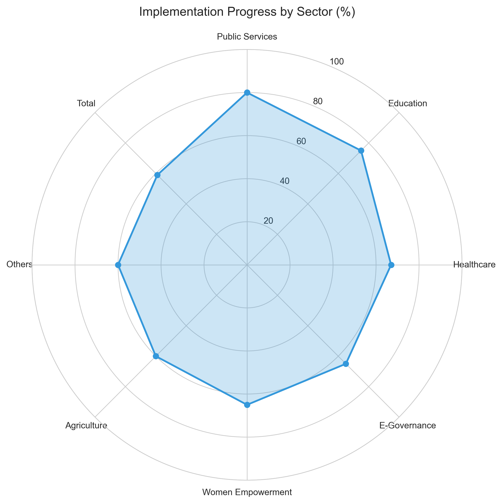

# GenAIReportGeneratorDemo
diff --git a/README.md b/README.md
index 0f804b4c9dcb9269d82c1eb7d4748c57196a6592..a5f8049978fc5d09cfbc6382666ca3c27ea4933d 100644
--- a/README.md
+++ b/README.md
@@ -1 +1,69 @@
-# GenAIReportGeneratorDemo
+# Generative AI Report Generator Demo
+
+This project demonstrates using a generative AI model to automatically create comprehensive PDF reports for government departments. It contains a Streamlit user interface that collects data, invokes `app.py` to produce visuals and text summaries, and saves the final PDF into the `reports/` folder.
+
+## Python Version
+
+The codebase targets **Python 3.11**. The environment used when building this demo was Python 3.11.12 and the requirements file documents the exact dependency versions.
+
+## Required Packages
+
+The key dependencies are listed in [`requirements.txt`](requirements.txt):
+
+```
+setuptools>=65.5.1
+wheel>=0.38.4
+streamlit==1.22.0
+pandas==1.5.3
+numpy==1.23.5
+matplotlib==3.7.1
+seaborn==0.12.2
+FPDF2==2.7.6
+ollama==0.1.6
+python-docx==1.1.0
+altair==4.2.2
+openpyxl==3.1.2
+squarify==0.4.3
+```
+
+Install these dependencies with:
+
+```bash
+pip install -r requirements.txt
+```
+
+## Running the Application
+
+Launch the Streamlit interface which wraps the report generation logic:
+
+```bash
+streamlit run user_interface.py
+```
+
+The UI allows you to toggle which data sources to include and upload your own files. When you click **Generate Report** a PDF is produced in the `reports/` directory and a download button appears.
+
+## Project Layout
+
+```
+.
+├── Data/        # sample CSV/JSON/text files consumed by the report
+├── charts/      # example visualisations generated by app.py
+├── reports/     # generated PDF reports
+├── app.py       # main report generation logic
+└── user_interface.py  # Streamlit front end
+```
+
+### Adding Custom Data
+
+Place any additional CSV, Excel, JSON, text or Word documents inside the `Data/` folder. Alternatively, use the *Upload Custom Data* section of the Streamlit sidebar which saves uploaded files into the same directory.
+
+Ensure filenames referenced in `app.py` correspond to your new files if you wish to include them automatically.
+
+## Example Output
+
+The repository contains sample images such as [`sector_radar_chart.png`](sector_radar_chart.png) and a number of generated PDFs inside [`reports/`](reports/). These demonstrate the type of charts and the final report you can expect.
+
+
+
+A complete PDF example is available at [`reports/Comprehensive_Departmental_Report_20250329_150328.pdf`](reports/Comprehensive_Departmental_Report_20250329_150328.pdf).
+
